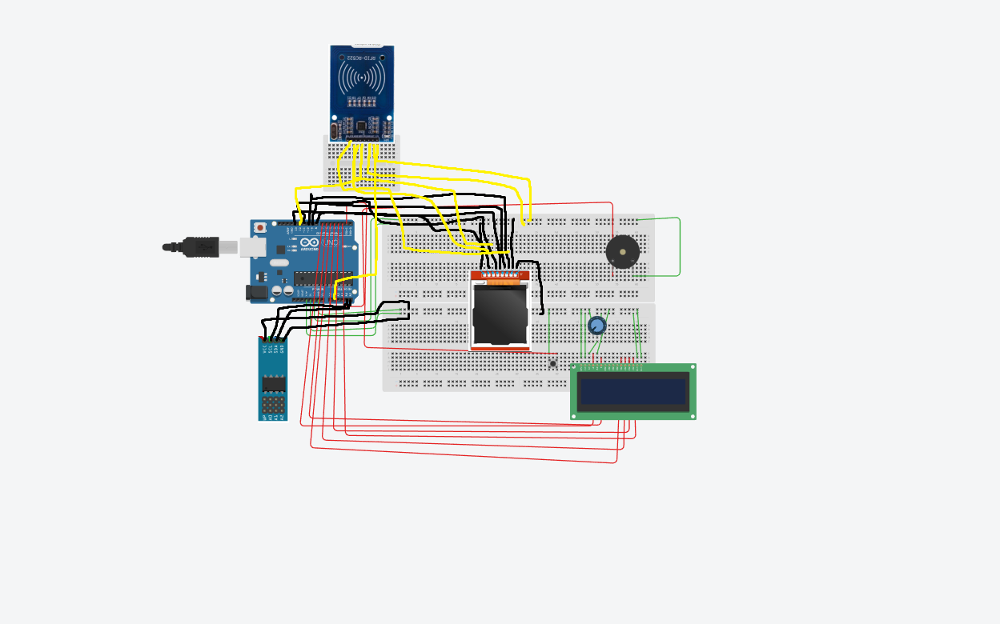
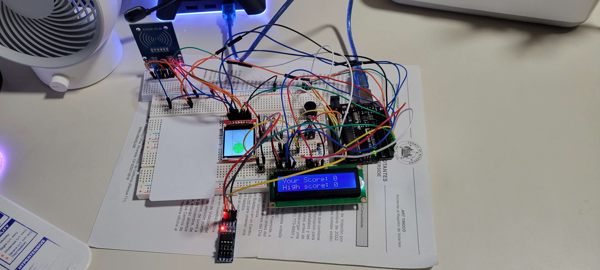
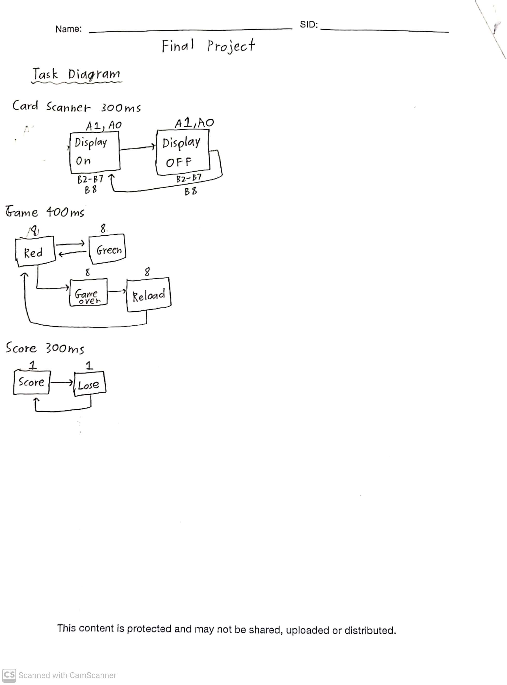
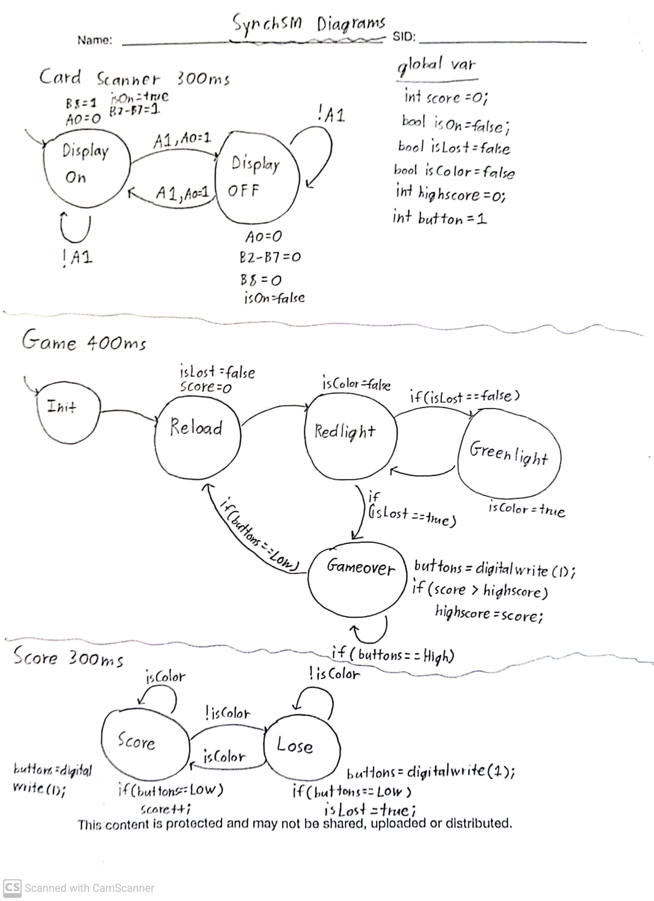

# Red-Light-Green-Light
CS120B Final Project (Arduino)

CS/EE 120B Custom Laboratory Project Report \
Red Light Green Light \
Alvin Hoang \
12/07/2022 

**Introduction:**
This project is a Red Light Green Light video game that is programmed onto a small 1.44’’ TFT Display that can only be accessed with an ID card. The player has to press the button when the light turns green and avoid pressing the button when it’s red. There will be a scoreboard that keeps track of the score in the game. The goal of the game is to get as many points as you can without pressing the red light. The lights change randomly using a random number generator. There is one bug where the displays do not turn off on the “Game Over” screen when the ID card is placed. Also, sometimes the button is not registered when the light turns green. 

**Complexities:**
* Using a random number generator to randomly blink the lights in the game (implemented)
* Using an external EEPROM to save the high score (implemented)
* Using an RFID kit to have it scan access cards to the game (not implemented)
* Using the TFT Display to output the graphics of the game (not implemented)

**User Guide:**
The baseline version would start with the user entering the game. The game is initially on and from there the user starts pressing the button whenever the streetlight turns green. If the user presses a green light then 1 point is added to his score. If he presses a red light then the game ends and can restart the game by holding the button down. At any time the user could scan the card reader with the card and the displays will turn off/turn blank. The buzzer will also make a sound for each time a card is successfully scanned. If the user achieves a higher score than the initial high score then the high score will be updated at the end of the game.  

**Hardware:** \
Computing: 
* Elegoo UNO R3 microcontroller 

Inputs: 
* ID Card (A1) 
* Button (1)
* EEPROM (A2)

Outputs:
* 1.44’’ TFT Display (8)
* LCD Display (2-7)
* Card Sensor Module (3.3V) (8)
* Buzzer (Plays sound when card scans) (A0)

**Software:**
* MFRC522.h: This library helped me read the correct card tag and see if there is a card present on the scanner.
* LiquidCrystal.h: This library was used to display the score and highscore on the LCD Display, as well as turn the display on and off.
* SPI.h: This library is included so that the Arduino Uno could communicate with SPI devices such as the card scanner and the 1.44’’ TFT Display.
* Wire.h: I used this library to be able to store and retrieve information from the EEPROM. By making functions that can read and write data, I utilized the wire library to write bytes into the corresponding addresses of the EEPROM.
* Adafruit_GFX.h: This library provided the graphics that are available to the 1.44’’ TFT Display. I used this library to help display the streetlight and the red/green flashes.
* TFT_ILI9163C.h: This is the TFT library. It is used to turn the TFT display on and off. It’s also used to fill the entire screen with one color.

**Wiring Diagram:**

**Task Diagrams:**

**SynchSM Diagrams:**

